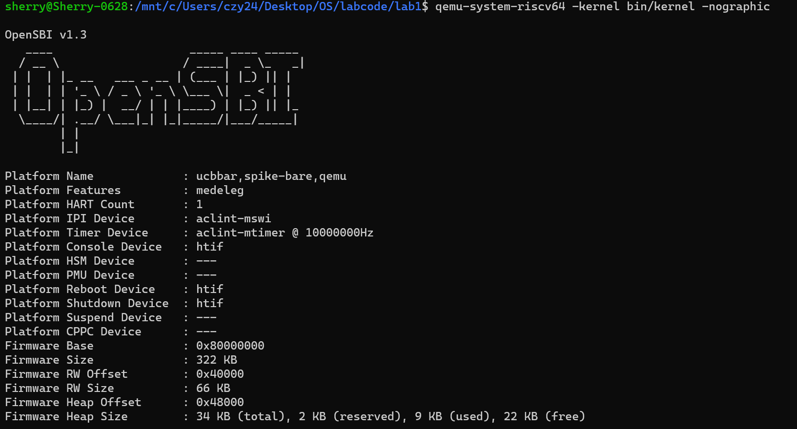
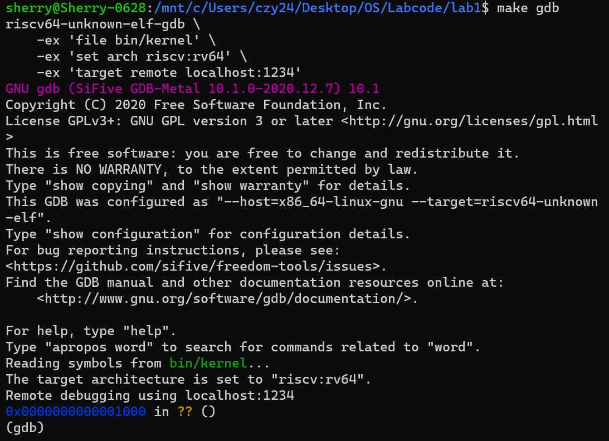

# Lab1

2311205李欣航&nbsp;&nbsp;&nbsp; 2310711陈子烨

## 练习一

阅读 kern/init/entry.S内容代码，结合操作系统内核启动流程，说明指令 la sp, bootstacktop 完成了什么操作，目的是什么？ tail kern_init 完成了什么操作，目的是什么？

1. `la sp,bootstacktop`:
`la`是 RISC-V 的装载地址伪指令，把全局符号 `bootstacktop` 的地址装入寄存器 `sp`，就是把内核栈顶地址写进了栈指针寄存器。
这条指令的目的是为进入 C 代码（后续函数调用、保存返回地址/临时变量、中断陷入等）提供一个可用且对齐的内核栈环境。

2. `tail kern_init`:
`tail` 是汇编伪指令，不保留返回地址的跳转到 `kern_init`，可视为对 `kern_init` 的尾调用，执行后不会返回到 `kern_entry`。

## 练习二

为了熟悉使用 QEMU 和 GDB 的调试方法，请使用 GDB 跟踪 QEMU 模拟的 RISC-V 从加电开始，直到执行内核第一条指令（跳转到 0x80200000）的整个过程。通过调试，请思考并回答：RISC-V 硬件加电后最初执行的几条指令位于什么地址？它们主要完成了哪些功能？请在报告中简要记录你的调试过程、观察结果和问题的答案。

### 实验步骤

在第一个终端输入`qemu-system-riscv64 -kernel bin/kernel -nographic`,得到如下输出：

打开第二个终端，跳转到指定路径后输入 `qemu-system-riscv64 -kernel bin/kernel -nographic -s -S`。`-S`参数会让虚拟CPU一启动就立刻暂停；`-s`参数会让 qemu 打开1234端口，准备接受GDB的连接。

打开第三个终端，输入`make gdb`，可以看到输出的后两行是
`Remote debugging using localhost:1234`    //成功连接到qemu
`0x0000000000001000 in ?? ()`     //显示当前程序计数器位置
表示我们已经连接成功。

用`gdb`进行调试，输入x/10i $pc，显示从当前程序计数器位置开始的10条汇编指令：

<pre style="background: #f8f8f8; padding: 10px; border-radius: 5px; font-family: 'Monaco', 'Consolas', monospace;">
(gdb) x/10i $pc
=> 0x1000:      auipc   t0,0x0      #将当前PC值的高20位与立即数0x0左移12位后相加，结果存入t0寄存器。
                                     t0 = PC + (0x0 << 12) = 0x1000 
   0x1004:      addi    a2,t0,40    #将t0的值加上40，结果存入a2寄存器。
                                     a2 = t0 + 40 = 0x1000 + 40 = 0x1028
   0x1008:      csrr    a0,mhartid  #读取mhartid控制状态寄存器的值到a0寄存器。
                                     a0 = mhartid = 0
   0x100c:      ld      a1,32(t0)   #从内存地址t0 + 32 = 0x1000 + 32 = 0x1020处加载双字到a1寄存器。
   0x1010:      ld      t0,24(t0)   #从内存地址t0 + 24 = 0x1000 + 24 = 0x1018处加载双字到t0寄存器。
   0x1014:      jr      t0          #跳转到t0寄存器指定的地址执行。
   0x1018:      unimp               #占位符
   0x101a:      0x8000              #数据值
   0x101c:      unimp               #占位符
   0x101e:      unimp               #占位符
</pre>

输入`si`换为单步执行，使用`info r t0`指令查看涉及到的寄存器的值：

<pre style="background: #f8f8f8; padding: 10px; border-radius: 5px; font-family: 'Monaco', 'Consolas', monospace;">
(gdb) si
0x0000000000001004 in ?? ()
(gdb) info r t0
t0             0x1000   4096
(gdb) si
0x0000000000001008 in ?? ()
(gdb) info r t0
t0             0x1000   4096
(gdb) si
0x000000000000100c in ?? ()
(gdb) info r t0
t0             0x1000   4096
(gdb) si
0x0000000000001010 in ?? ()
(gdb) info r t0
t0             0x1000   4096
(gdb) si
0x0000000000001014 in ?? ()
(gdb) info r t0
t0             0x80000000       2147483648  
#到0x1014时，跳转到0x80000000，t0寄存器里的值发生变化，变为2147483648
(gdb) si
0x0000000080000000 in ?? ()
</pre>

接下来我们跳转到`0x80000000`查看后面的20条汇编指令：

(gdb) x/20i 0x80000000   
<pre style="background: #f8f8f8; padding: 10px; border-radius: 5px; font-family: 'Monaco', 'Consolas', monospace;">
=> 0x80000000:  add     s0,a0,zero        #将a0寄存器的值保存到s0寄存器
   0x80000004:  add     s1,a1,zero        #将a1寄存器的值保存到s1寄存器
   0x80000008:  add     s2,a2,zero        #将a2寄存器的值保存到s2寄存器
   0x8000000c:  jal     ra,0x80000580     #跳转到0x80000580处，返回地址保存到ra寄存器
   0x80000010:  add     a6,a0,zero        #将函数返回值(a0)保存到a6寄存器
   0x80000014:  add     a0,s0,zero        #恢复a0的原始值(从s0)
   0x80000018:  add     a1,s1,zero        #恢复a1的原始值(从s1)
   0x8000001c:  add     a2,s2,zero        #恢复a2的原始值(从s2)
   0x80000020:  li      a7,-1             #将a7寄存器设置为-1
   0x80000022:  beq     a6,a7,0x8000002a  #如果a6 == -1，跳转到0x8000002a
   0x80000026:  bne     a0,a6,0x800000da  #如果a0 != a6，跳转到0x800000da
   0x8000002a:  auipc   a6,0x40           #将PC + 0x40000加载到a6
   0x8000002e:  addi    a6,a6,-34         #计算最终地址 a6 = a6 - 34
   0x80000032:  li      a7,1              #将a7寄存器设置为1
   0x80000034:  amoadd.w        a6,a7,(a6) 
   #原子操作：将内存[a6]的值加到a7，结果存a6，然后内存[a6] = a7
   0x80000038:  bnez    a6,0x800000da     #如果a6 != 0，跳转到0x800000da
   0x8000003c:  auipc   t0,0x40           #将PC + 0x40000加载到t0
   0x80000040:  addi    t0,t0,-36         #t0 = t0 - 36
   0x80000044:  auipc   t1,0x0            #将PC加载到t1
   0x80000048:  addi    t1,t1,-68         #t1 = t1 - 68
</pre>

上述汇编指令可分为两部分：函数调用和基本检查`(0x80000000-0x80000026)`；错误处理-原子操作和锁`(0x8000002a-0x80000048)`，实现的是一个带锁的系统调用错误处理机制。

接下来输入`break kern_entry`指令，在`kern_entry`函数的第一条指令处设置断点，得到的输出如下：

<pre style="background: #f8f8f8; padding: 10px; border-radius: 5px; font-family: 'Monaco', 'Consolas', monospace;">
Breakpoint 1 at 0x80200000: file kern/init/entry.S, line 7.
</pre>

由此可知，`kern_entry`函数第一条指令的地址就在`0x80200000`。查阅实验代码中`kernel.ld`文件的内容后，我们发现其中有一句为`BASE_ADDRESS = 0x80200000`，这说明地址`0x80200000`是由`kernel.ld`中的`BASE_ADDRESS`所决定的，而`kern_entry`则是`kernel.ld`中定义的入口点。

接下来我们查看`0x80200000`后面的10条汇编指令：

<pre style="background: #f8f8f8; padding: 10px; border-radius: 5px; font-family: 'Monaco', 'Consolas', monospace;">
(gdb) x/10i 0x80200000
   0x80200000 &lt;kern_entry&gt;:     auipc   sp,0x3     #将PC + 0x3000加载到sp，设置栈指针高位
   0x80200004 &lt;kern_entry+4&gt;:   mv      sp,sp      #空操作
   0x80200008 &lt;kern_entry+8&gt;:   j       0x8020000a &lt;kern_init&gt; #无条件跳转到kern_init函数
   0x8020000a &lt;kern_init&gt;:      auipc   a0,0x3     #将PC + 0x3000加载到a0
   0x8020000e &lt;kern_init+4&gt;:    addi    a0,a0,-2   #调整地址值 a0 = a0 - 2 
   0x80200012 &lt;kern_init+8&gt;:    auipc   a2,0x3     #将PC + 0x3000加载到a2
   0x80200016 &lt;kern_init+12&gt;:   addi    a2,a2,-10  #调整地址值 a2 = a2 - 10
   0x8020001a &lt;kern_init+16&gt;:   addi    sp,sp,-16  #栈指针sp向下移动16字节，分配栈空间
   0x8020001c &lt;kern_init+18&gt;:   li      a1,0       #将a1寄存器设置为0
   0x8020001e &lt;kern_init+20&gt;:   sub     a2,a2,a0   #计算a2和a0的差值，结果存入a2
</pre>

从上述代码中我们可以看到，在`kern_entry`之后就是`kern_init`。`kern_entry`是内核入口点，`kern_init`进行内核初始化。

然后输入`continue`，一直执行直至遇到断点，执行完后会发现debug界面（即之前的终端二）输出经典的`openSBI`信息，说明`openSBI`已经启动。

我们在`kern_init`处设置第二个断点，命令为`break kern_init`。得到的输出如下：

<pre style="background: #f8f8f8; padding: 10px; border-radius: 5px; font-family: 'Monaco', 'Consolas', monospace;">
Breakpoint 2 at 0x80200000: file kern/init/init.c, line 8.
</pre>

可以看到指向了之前显示为`kern_init`的地址`0x80200000`。

接下来我们再输入`continue`，用`disassemble kern_init`查看`kern_init`相应的反汇编代码：

<pre style="background: #f8f8f8; padding: 10px; border-radius: 5px; font-family: 'Monaco', 'Consolas', monospace;">
(gdb) disassemble kern_init
Dump of assembler code for function kern_init:
=> 0x000000008020000a &lt;+0&gt;:     auipc   a0,0x3       #将PC + 0x3000加载到a0，计算地址高位
   0x000000008020000e &lt;+4&gt;:     addi    a0,a0,-2     #a0 = a0 - 2，计算得到地址0x80203008
   0x0000000080200012 &lt;+8&gt;:     auipc   a2,0x3       #将PC + 0x3000加载到a2，计算地址高位
   0x0000000080200016 &lt;+12&gt;:    addi    a2,a2,-10 #  #a2 = a2 - 10，计算得到地址0x80203008
   0x000000008020001a &lt;+16&gt;:    addi    sp,sp,-16    #栈指针下移16字节，分配栈空间
   0x000000008020001c &lt;+18&gt;:    li      a1,0         #a1 = 0（memset的填充值）
   0x000000008020001e &lt;+20&gt;:    sub     a2,a2,a0     #a2 = a2 - a0，计算内存区域大小
   0x0000000080200020 &lt;+22&gt;:    sd      ra,8(sp)     #将返回地址保存到栈上
   0x0000000080200022 &lt;+24&gt;:    jal     ra,0x802004b6 &lt;memset&gt;   #调用memset函数清零内存
   0x0000000080200026 &lt;+28&gt;:    auipc   a1,0x0       #将PC加载到a1，计算地址高位
   0x000000008020002a &lt;+32&gt;:    addi    a1,a1,1186   #a1 = a1 + 1186，得到地址0x802004c8
   0x000000008020002e &lt;+36&gt;:    auipc   a0,0x0       #将PC加载到a0，计算地址高位
   0x0000000080200032 &lt;+40&gt;:    addi    a0,a0,1210   #a0 = a0 + 1210，得到地址0x802004e8
   0x0000000080200036 &lt;+44&gt;:    jal     ra,0x80200056 &lt;cprintf&gt;    #调用cprintf函数输出信息
   0x000000008020003a &lt;+48&gt;:    j       0x8020003a &lt;kern_init+48&gt;  #又回到开头，一直循环
End of assembler dump.
</pre>

可以发现最后`0x0000000008020003a`地址处的指令是`j 0x8020003a <kern_init+48>`，跳转到循环的开始，所以会一直循环下去。

再次输入continue，此时debug界面输出：

<pre style="background: #f8f8f8; padding: 10px; border-radius: 5px; font-family: 'Monaco', 'Consolas', monospace;">
(THU.CST) os is loading ...
</pre>

至此，我们模拟完了 `RISC-V` 从加电开始，直到执行内核第一条指令（跳转到 `0x80200000`）的整个过程。

### 问题回答

1. `RISC-V`硬件加电后最初执行的几条指令位于什么地址？
   `RISC-V`加电后的指令地址位于`0x1000`到`0x1014`。

2. 它们主要完成了哪些功能？
- `auipc t0,0x0`：将当前`PC`值的高`20`位与立即数`0x0`左移`12`位后相加，结果存入`t0`寄存器。`t0 = PC + (0x0 << 12) = 0x1000 `
- `addi a2,t0,40`：将`t0`的值加上`40`，结果存入`a2`寄存器。`a2 = t0 + 40 = 0x1000 + 40 = 0x1028`
- `csrr a0,mhartid`：读取`mhartid`控制状态寄存器的值到`a0`寄存器，`mhartid`是正在运行代码的硬件线程的整数ID。
- `ld a1,32(t0)`：从内存地址`t0 + 32 = 0x1000 + 32 = 0x1020`处加载双字到`a1`寄存器。
- `ld t0,24(t0)`：从内存地址`t0 + 24 = 0x1000 + 24 = 0x1018`处加载双字到`t0`寄存器。
- `jr t0 `：跳转到`t0`寄存器指向的`0x80000000`执行。

## 知识点梳理

### 实验中重要知识点及其与OS原理的对应关系

| 序号 | 实验中的知识点  | 对应的OS原理知识点 | 含义与关系说明 |
|------|----------------|---------------------|----------------|
| 1 | **启动流程与Bootloader** | 系统启动与引导程序 | 实验中通过Qemu + OpenSBI模拟启动流程，OS原理中Bootloader负责初始化硬件并加载内核。实验体现了Bootloader将控制权移交内核的过程。 |
| 2 | **内核栈初始化** | 进程/线程栈管理 | 实验中使用`la sp, bootstacktop`初始化内核栈，OS原理中栈用于函数调用、中断处理等，是执行环境的必备部分。 |
| 3 | **内存布局与链接脚本** | 内存管理与地址空间 | 实验通过`kernel.ld`指定内核加载地址`0x80200000`，OS原理中链接脚本定义程序的内存布局，是虚拟内存管理的基础。 |
| 4 | **内核入口与初始化** | 内核初始化与系统启动 | 实验中的`kern_entry`和`kern_init`是内核的起点，对应OS原理中内核初始化流程，包括内存清零、打印信息等。 |
| 5 | **调试与反汇编分析** | 系统调试与异常分析 | 实验使用GDB/Qemu跟踪指令流，OS原理中调试是理解系统行为、定位异常的重要手段。 |

### 实验过程与OS原理的差异与联系

1. 联系：实验通过具体代码和调试过程，具象化了OS原理中抽象的启动流程、内存初始化、控制权转移等概念。

2. 差异：

- 实验中使用的是 qemu 模拟器和 RISC-V架构，而OS原理通常是架构无关的。

- 实验中的启动流程依赖于OpenSBI，而传统OS原理可能介绍的是BIOS/UEFI + GRUB等组合。

- 实验尚未涉及进程调度、文件系统、系统调用等核心机制，仍处于“最小内核”阶段。

### OS原理重要但实验中未涉及的知识点

| 序号 | OS原理中的重要知识点 | 说明 |
|------|------------------------|------|
| 1 | **进程管理与调度** | 包括进程创建、切换、调度算法（如RR、CFS）等，是OS核心功能。 |
| 2 | **虚拟内存与页表** | 如分页机制、TLB、页面置换算法等，实验中尚未启用MMU。 |
| 3 | **文件系统** | 如inode、目录结构、文件读写等，实验中仅输出字符串，无存储抽象。 |
| 4 | **系统调用机制** | 用户态与内核态的切换、系统调用接口等，实验中尚未区分权限模式。 |
| 5 | **并发与同步** | 如锁、信号量、死锁处理等，实验中尚未涉及多线程或中断并发。 |

