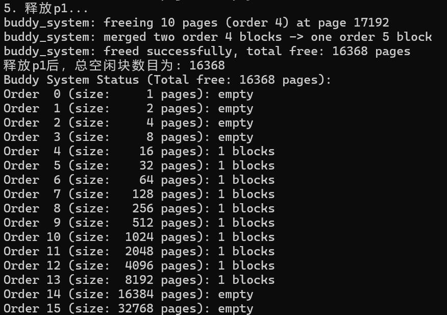

# Lab2

2311205李欣航&nbsp;&nbsp;&nbsp; 2311378姜润林&nbsp;&nbsp;&nbsp; 2310711陈子烨

## 练习1：理解 first-fit 连续物理内存分配算法

### 主要思想

`First Fit` 算法的核心思想是，当需要分配一个资源请求时，它会从内存或存储空间的起始地址开始，顺序遍历空闲区域列表，并选择所遇到的**第一个**大小满足该请求的空闲块进行分配，而不会继续寻找后续可能存在的、大小更吻合的空闲块。

`First Fit`算法以实现简单和分配速度快为主要优点，因为它通常无需遍历整个列表；但其代价是容易在内存的低地址部分留下大量难以利用的小碎片，从而可能降低内存的长期利用率。

### 具体实现

在操作系统中实现 `First Fit` 算法的核心是**维护一个按地址排序的空闲内存块链表**。当收到内存请求时，算法从链表头部开始顺序遍历，找到**第一个**大小满足需求的空闲块：若大小正好匹配，则将该节点从链表中移除；若该空闲块更大，则将其分割，仅分配请求大小的部分，并将剩余部分作为新空闲块更新回链表。

### 相关代码分析

#### 数据结构

```C
static free_area_t free_area;

#define free_list (free_area.free_list) //内存空闲块链表
#define nr_free (free_area.nr_free)     //空闲页面总数
```

`free_area_t` 是用于管理物理内存的空闲区域的数据结构，在`memlayout.h`中可以找到它的定义：

```C
typedef struct {
    list_entry_t free_list;      //空闲内存块的链表头
    unsigned int nr_free;        //空闲页面的总数
} free_area_t;
```

#### 初始化函数 default_init

```C
static void
default_init(void) {
    list_init(&free_list);
    nr_free = 0;
}
```

该函数用于初始化双向链表的头节点和空闲页面计数器。函数调用`list_init`函数初始化了一个空的双向链表`free_list`，然后定义了`nr_free = 0`，也就是将空闲块的个数定义为`0`。

#### 初始化函数 default_init_memmap

```C
static void
default_init_memmap(struct Page *base, size_t n) {
    assert(n > 0);                     //确保要初始化的页面数量大于0
    struct Page *p = base;             //创建遍历指针p，指向起始页面
    for (; p != base + n; p ++) {      //base + n 是指针运算，表示从 base 开始向后移动 n 个 struct Page 的位置，循环会遍历从 base 到 base + n - 1 的所有页面
        assert(PageReserved(p));       //检查页面是否被标记为"保留"状态
        p->flags = p->property = 0;    //将页面的所有标志位和属性清零
        set_page_ref(p, 0);            //将页面的引用次数设为0
    }
    base->property = n;                //在首个页面的property属性设为n，即空闲块的总大小
    SetPageProperty(base);             //设置页面的属性值
    nr_free += n;                      //更新空闲页面数量（加了n，因为刚才初始化了n个空闲页面）
    if (list_empty(&free_list)) {      //判断该列表是否为空
        list_add(&free_list, &(base->page_link));  //若空，将起始页面的链表节点添加到链表中
    } else {                           //若不空，则要按地址排序插入
        list_entry_t* le = &free_list; //先初始化一个指针指向空闲链表头
        while ((le = list_next(le)) != &free_list) {  //一直向后找，按物理地址从小到大排列
            struct Page* page = le2page(le, page_link);
            if (base < page) {         //若新页面的起始地址base小于当前遍历到的页面page的地址，说明找到了合适插入位置
                list_add_before(le, &(base->page_link));  //在当前位置的前面插入新节点
                break;
            } else if (list_next(le) == &free_list) {  //如不是，则插入到末尾
                list_add(le, &(base->page_link));
            }
        }
    }
}
```

该函数的作用为：初始化一段连续的物理内存页面，将其标记为空闲状态，并加入到空闲内存管理链表中。

函数首先对一段连续的物理内存页面进行初始化准备：它遍历从起始页面`base`开始的`n`个连续页面，确保每个页面都处于保留状态，然后清除所有页面的标志位和属性值，并将引用计数设为`0`，表示这些页面当前未被使用且处于干净状态。

接下来函数将这段连续页面组织成一个完整的空闲内存块：仅在起始页面`base`中设置`property`属性为`n`来记录整个块的大小，并标记该页面为块头页面，而其他页面保持普通页面状态。同时更新全局空闲页面计数器`nr_free`，增加`n`个页面的计数。

最后函数将这个新初始化的空闲块按物理地址顺序插入到空闲链表中：如果链表为空则直接插入；否则遍历链表，找到第一个地址比当前块大的位置并在其前面插入，或者如果当前块地址最大则插入到链表末尾，确保链表始终按地址从小到大排序，为后续的内存合并操作奠定基础。

#### 内存分配函数 default_alloc_pages

```C
static struct Page *
default_alloc_pages(size_t n) {           //参数为请求分配的连续页面数量
    assert(n > 0);                        //确保请求的页面数大于0
    if (n > nr_free) {                    //快速检查系统是否有足够的空闲页面
        return NULL;                      //如果请求的数量大于系统中空闲堆数量，则返回NULL
    }
    struct Page *page = NULL;             //用于记录找到的合适页面
    list_entry_t *le = &free_list;        //遍历指针，从链表头开始
    while ((le = list_next(le)) != &free_list) {  //获取下一个节点，且下一个不能是链表头，否则就回去了
        struct Page *p = le2page(le, page_link);  //将链表节点转换为对应的Page结构体指针
        if (p->property >= n) {           //检查当前空闲块的大小是否满足需求
            page = p;                     //记录找到的合适页面
            break;                        
        }
    }
    if (page != NULL) {                   //确认是否找到了合适的空闲块，如果 page 仍然是 NULL，说明没有足够大的空闲块
        list_entry_t* prev = list_prev(&(page->page_link));   //获取当前页面在链表中的前驱节点
        list_del(&(page->page_link));     //将找到的空闲块从链表中移除
        if (page->property > n) {         //检查找到的空闲块是否大于请求的大小，如果正好相等则不需要分割；如果更大则需要分割剩余部分
            struct Page *p = page + n;    //page + n 表示从 page 开始向后移动 n 个 struct Page 的位置
            p->property = page->property - n;   //设置剩余块的大小
            SetPageProperty(p);           //标记剩余块的第一个页面为块头页面
            list_add(prev, &(p->page_link));    //将剩余的空闲块插入到原位置的前驱节点后面
        }
        nr_free -= n;                     //更新全局空闲页面计数器
        ClearPageProperty(page);          //清除分配页面的 PG_property 标志
    }
    return page;                          //返回分配的内存块起始页面指针
}
```

该函数的作用为：使用首次适应算法从空闲链表中分配指定数量的连续物理页面。

函数首先验证请求的页面数量有效性，并快速检查系统总空闲页面是否足够。接着使用首次适应算法遍历按地址排序的空闲链表，寻找第一个大小满足需求的空闲内存块，通过`le2page`宏将链表节点转换为页面结构体指针进行比较，找到后立即停止搜索。

找到合适空闲块后，函数记录其前驱节点位置并将其从链表中移除。如果该空闲块大小大于请求数量，则进行分割处理：计算剩余部分的起始页面，设置其大小属性并标记为新的空闲块头页面，然后将剩余部分插入到原位置的前驱节点后，保持链表有序性。

最后函数更新全局空闲页面计数器，减少已分配的页面数量，并清除分配块的头页面标志位，表明该页面已被分配使用。最终返回分配的内存块起始页面指针，完成整个分配流程，若搜索阶段未找到合适块则直接返回`NULL`表示分配失败。

#### 内存释放函数 default_free_pages

```C
static void
default_free_pages(struct Page *base, size_t n) {
    assert(n > 0);                        //确保释放的页面数大于0        
    struct Page *p = base;
    for (; p != base + n; p ++) {
        assert(!PageReserved(p) && !PageProperty(p));    //确保页面不是系统保留页面，也不是空闲块的头页面
        p->flags = 0;                     //清除页面标志
        set_page_ref(p, 0);               //引用计数清零
    }
    base->property = n;                   //记录空闲块大小
    SetPageProperty(base);                //标记为空闲块首页面
    nr_free += n;                         //更新计数器

    if (list_empty(&free_list)) {         //插入操作，与default_init_memmap中的逻辑相同，不再赘述
        list_add(&free_list, &(base->page_link));
    } else {
        list_entry_t* le = &free_list;
        while ((le = list_next(le)) != &free_list) {
            struct Page* page = le2page(le, page_link);
            if (base < page) {
                list_add_before(le, &(base->page_link));
                break;
            } else if (list_next(le) == &free_list) {
                list_add(le, &(base->page_link));
            }
        }
    }

    //向前合并（与低地址块合并）
    list_entry_t* le = list_prev(&(base->page_link));   //获取当前块在链表中的前一个节点
    if (le != &free_list) {              //确保前驱节点不是链表头，即确实存在前一个空闲块
        p = le2page(le, page_link);      //前一个空闲块的起始页面              
        if (p + p->property == base) {   //检查前一个块的结束是否正好等于当前块的开始，property是空闲块的大小
            p->property += base->property;   //合并块大小
            ClearPageProperty(base);         //清除原块头标志
            list_del(&(base->page_link));    //从链表移除原块
            base = p;                        //更新base指向合并后的块，为后续合并做准备
        }
    }

    //向后合并（与高地址块合并）
    le = list_next(&(base->page_link)); //获取当前块在链表中的后一个节点
    if (le != &free_list) {
        p = le2page(le, page_link);
        if (base + base->property == p) {    //检查当前块的结束是否正好等于后一个块的开始
            base->property += p->property;   //合并块大小
            ClearPageProperty(p);            //清除被合并块的头标志
            list_del(&(p->page_link));       //从链表移除被合并块
        }
    }
}
```

该函数的作用为：释放一段已分配的连续物理页面，将其重新加入空闲链表，并尝试与相邻的空闲块合并以减少碎片。

函数首先验证释放页面的有效性，确保它们既非系统保留页面也非已空闲页面，然后重置所有页面的标志位和引用计数，将其恢复为干净状态。接着在起始页面设置空闲块大小属性并标记为块头页面，同时更新全局空闲页面计数器，完成基本内存状态的转换。

随后函数将新释放的空闲块按物理地址顺序插入到空闲链表中。如果链表为空则直接插入，否则遍历链表找到合适的插入位置，确保链表始终保持按地址从小到大排序，为后续的合并操作奠定基础，这是减少内存碎片的关键前提。

最后函数执行双向合并操作以减少内存碎片：先检查并合并低地址方向的相邻空闲块，更新基指针后再检查合并高地址方向的相邻块。通过计算物理地址的连续性判断是否相邻，合并时调整块大小属性、清除多余的头页面标志并清理链表节点，最终形成一个更大的连续空闲块。

#### 辅助函数 default_nr_free_pages

```C
static size_t
default_nr_free_pages(void) {
    return nr_free;
}
```

这是一个简单的获取器函数，用于获取当前系统中可用的空闲物理页面总数。它直接返回全局变量`nr_free`的值，该变量在内存分配时减少、在内存释放时增加，为其他系统组件提供了一种快速查询内存剩余情况的方法，无需遍历复杂的空闲链表结构，具有`O(1)`的时间复杂度。

#### 测试函数 basic_check()

```C
static void
basic_check(void) {
    struct Page *p0, *p1, *p2;             //分配三个单独的页面，检查分配是否成功（返回值不为NULL即为成功）
    p0 = p1 = p2 = NULL;
    assert((p0 = alloc_page()) != NULL);
    assert((p1 = alloc_page()) != NULL);
    assert((p2 = alloc_page()) != NULL);

    assert(p0 != p1 && p0 != p2 && p1 != p2);  //页面唯一性验证，确保三个指针指向不同的物理页面
    assert(page_ref(p0) == 0 && page_ref(p1) == 0 && page_ref(p2) == 0);                            //页面引用计数检查，page_ref(p) 应该返回页面的引用计数，新分配的页面引用计数应该为0

    assert(page2pa(p0) < npage * PGSIZE);  //物理地址范围的有效性验证，确保分配的页面地址不越界
    assert(page2pa(p1) < npage * PGSIZE);  //page2pa(p)将页面指针转换为物理地址，npage * PGSIZE是系统总物理内存大小
    assert(page2pa(p2) < npage * PGSIZE);

    list_entry_t free_list_store = free_list;  //模拟内存耗尽，测试内存不足时的处理，尝试分配页面应该返回NULL（分配失败）
    list_init(&free_list);
    assert(list_empty(&free_list));

    unsigned int nr_free_store = nr_free;
    nr_free = 0;

    assert(alloc_page() == NULL);

    free_page(p0);                        //页面释放测试，释放之前分配的三个页面，检查空闲页面计数器是否正确更新为3
    free_page(p1);
    free_page(p2);
    assert(nr_free == 3);

    assert((p0 = alloc_page()) != NULL);  //重新分配测试，重新分配三个页面，尝试分配第四个页面（应该失败，因为只有三个空闲页面）
    assert((p1 = alloc_page()) != NULL);
    assert((p2 = alloc_page()) != NULL);

    assert(alloc_page() == NULL);

    //链表状态和分配顺序测试，验证空闲链表状态和分配算法
    free_page(p0);                        //释放一个页面，链表不应该为空                 
    assert(!list_empty(&free_list));

    struct Page *p;
    assert((p = alloc_page()) == p0);     //验证首次适应算法：刚刚释放的p0应该在空闲链表中，下一次分配应该返回p0
    assert(alloc_page() == NULL);         //再次分配应该失败

    //恢复测试环境并清理资源，nr_free应该为0，所有页面都已分配
    assert(nr_free == 0);                 
    free_list = free_list_store;
    nr_free = nr_free_store;

    free_page(p);
    free_page(p1);
    free_page(p2);
}
```

该函数的作用为：对物理内存分配器和释放器进行一系列基本功能测试，验证分配、释放、页面属性等核心功能的正确性。

函数首先验证物理内存管理器的基本分配和释放功能，通过分配多个页面检查其唯一性、引用计数初始状态以及物理地址有效性，确保分配器能正确提供不重复的合法内存页面。随后测试模拟内存耗尽场景，清空空闲链表后验证分配失败行为，并测试页面释放后计数器和链表状态的正确更新，全面检验内存管理的基本操作可靠性。

接下来函数进一步验证首次适应算法的特性，通过释放页面后立即重新分配来确认算法优先分配最近释放的块，同时检查空闲链表的状态管理。测试最后执行状态恢复操作，将全局变量还原到测试前状态并清理所有测试页面，确保测试过程不影响系统后续运行，完整覆盖了内存管理器的正常操作、边界条件处理和环境隔离能力。

#### 测试函数 default_check()

```C
static void
default_check(void) {
    int count = 0, total = 0;                      //验证空闲链表的内部一致性
    list_entry_t *le = &free_list;
    while ((le = list_next(le)) != &free_list) {
        struct Page *p = le2page(le, page_link);
        assert(PageProperty(p));
        count ++, total += p->property;
    }
    assert(total == nr_free_pages());

    basic_check();                                //运行基础测试

    struct Page *p0 = alloc_pages(5), *p1, *p2;   //大块分配测试
    assert(p0 != NULL);
    assert(!PageProperty(p0));

    list_entry_t free_list_store = free_list;     //内存耗尽环境设置
    list_init(&free_list);
    assert(list_empty(&free_list));
    assert(alloc_page() == NULL);

    unsigned int nr_free_store = nr_free;
    nr_free = 0;

    free_pages(p0 + 2, 3);                        //部分释放和分割测试
    assert(alloc_pages(4) == NULL);
    assert(PageProperty(p0 + 2) && p0[2].property == 3);
    assert((p1 = alloc_pages(3)) != NULL);
    assert(alloc_page() == NULL);
    assert(p0 + 2 == p1);

    p2 = p0 + 1;                                  //复杂合并场景测试
    free_page(p0);
    free_pages(p1, 3);
    assert(PageProperty(p0) && p0->property == 1);
    assert(PageProperty(p1) && p1->property == 3);

    assert((p0 = alloc_page()) == p2 - 1);        //分配顺序和边界测试
    free_page(p0);
    assert((p0 = alloc_pages(2)) == p2 + 1);

    free_pages(p0, 2);                            //最终合并测试
    free_page(p2);

    assert((p0 = alloc_pages(5)) != NULL);
    assert(alloc_page() == NULL);

    assert(nr_free == 0);                         //状态恢复和最终验证
    nr_free = nr_free_store;

    free_list = free_list_store;
    free_pages(p0, 5);

    le = &free_list;
    while ((le = list_next(le)) != &free_list) {
        struct Page *p = le2page(le, page_link);
        count --, total -= p->property;
    }
    assert(count == 0);
    assert(total == 0);
}
```

该函数的作用为：对首次适应内存分配算法进行深入测试，验证内存分割、合并、分配顺序等复杂场景的正确性。

这个测试函数通过精心设计的场景，全面验证了首次适应算法在复杂情况下的正确性，包括内存分割、跨碎片合并、分配顺序等重要特性，确保内存管理器在真实使用场景中的可靠性。

#### 结构体 default_pmm_manager

```C
const struct pmm_manager default_pmm_manager = {
    .name = "default_pmm_manager",           //管理器标识
    .init = default_init,                    //初始化函数
    .init_memmap = default_init_memmap,      //内存映射初始化
    .alloc_pages = default_alloc_pages,      //页面分配函数
    .free_pages = default_free_pages,        //页面释放函数
    .nr_free_pages = default_nr_free_pages,  //空闲页面查询
    .check = default_check,                  //自检函数
};
```

`default_pmm_manager` 结构体是物理内存管理器的核心接口，它封装了完整的首次适应算法实现，提供了标准化的内存管理接口，支持系统启动自检和状态监控，为上层系统组件提供稳定的内存服务，具有良好的可扩展性和可维护性。

### 各函数作用分析

- **`default_init`**：初始化空闲内存块的链表，将空闲块的个数设置为`0`。
- **`default_init_memmap`**：用于初始化一个空闲内存块。先查询空闲内存块的链表，按照地址顺序插入到合适的位置，并将空闲内存块个数加`n`。
- **`default_alloc_pages`**：用于分配给定大小的内存块。如果剩余空闲内存块数量多于所需的内存区块数量，则从链表中查找大小超过所需大小的页，并更新该页剩余的大小。
- **`default_free_pages`**：用于释放内存块。将释放的内存块按照顺序插入到空闲内存块的链表中，并合并与之相邻且连续的空闲内存块。
- **`default_nr_free_pages`**：用于获取当前的空闲页面的数量。
- **`basic_check`**：基本功能检测。
- **`default_check`**：进阶功能检测。
- **结构体`default_pmm_manager`**：方便后续的调用，将上述功能包装为结构体。

### First Fit 算法改进空间

- **引入块大小分类管理**：可以将空闲块按大小范围划分到不同的链表中进行管理，这样能减少搜索时间，优化了小块分配的效率，同时保持大块分配的灵活性。
- **实现`Next Fit`分配策略**：针对当前`First Fit`算法总是从链表头开始搜索导致低地址碎片集中的问题，可以改为`Next Fit`算法，这样可以避免低地址区域产生大量无法使用的小碎片。
- **建立分割阈值机制**：当前实现无条件分割大块内存，容易产生很多过小的碎片。可以引入最小分割阈值概念，只有当分割后的剩余块大小超过某个阈值时才执行分割操作。
- **采用延迟合并策略**：现有的立即合并策略在频繁分配释放场景下会带来一定的的性能开销。可以改为延迟合并机制，等到空闲块数量积累到一定阈值或系统空闲时再执行批量合并操作。
- **添加内存碎片监控与整理**：可以增加碎片度监控机制，定期评估内存碎片化程度，当碎片超过阈值时触发主动整理操作。


## 练习2：实现 Best-Fit 连续物理内存分配算法
参考 `default_pmm.c` 中的框架，基于页链表`free_list`实现了 `Best-Fit`页面分配算法。物理内存以页为基本管理单位，每个空闲块（连续页）通过 `Page` 结构记录 `property` 字段指示块大小，并挂入空闲链表中。

补充代码分析：
### 1.best_fit_init_memmap
```C
//清空当前页框的标志和属性信息，并将页框的引用计数设置为0。
p->flags=0;
p->property=0;
set_page_ref(p,0);
```

```C
// 1、当base < page时，找到第一个大于base的页，将base插入到它前面，并退出循环
if(base<page){
    list_add_before(le, &(base->page_link));
    break;
}
// 2、当list_next(le) == &free_list时，若已经到达链表结尾，将base插入到链表尾部
if(list_next(le)==&free_list){
    list_add(le,&(base->page_link));
    break;
}
```

### 2.best_fit_alloc_pages
```C
size_t min_size = nr_free + 1;
//开始前把min_size最小可用块大小设置为一个足够大的上界

// 遍历空闲链表，查找满足需求的空闲页框
// 如果找到满足需求的页面，记录该页面以及当前找到的最小连续空闲页框数量

while ((le = list_next(le)) != &free_list) {
    struct Page *p = le2page(le, page_link);
    if (p->property >= n && p->property < min_size) {
        page = p;
        min_size = p->property;
        //不break，继续找更小的
    }
}
```

### 3.best_fit_free_pages
```C
// 具体来说就是设置当前页块的属性为释放的页块数、并将当前页块标记为已分配状态、最后增加nr_free的值
//这里同first-fit，不再赘述
    base->property=n;
    SetPageProperty(base);
    nr_free+=n;

    if (list_empty(&free_list)) {
        list_add(&free_list, &(base->page_link));
    } else {
        list_entry_t* le = &free_list;
        while ((le = list_next(le)) != &free_list) {
            struct Page* page = le2page(le, page_link);
            if (base < page) {
                list_add_before(le, &(base->page_link));
                break;
            } else if (list_next(le) == &free_list) {
                list_add(le, &(base->page_link));
                break;
            }
        }
    }
```

```C
    list_entry_t* le = list_prev(&(base->page_link));
    if (le != &free_list) {
        p = le2page(le, page_link);
        /*LAB2 EXERCISE 2: YOUR CODE*/ 
        // 编写代码
        // 1、判断前面的空闲页块是否与当前页块是连续的，如果是连续的，则将当前页块合并到前面的空闲页块中
        // 2、首先更新前一个空闲页块的大小，加上当前页块的大小
        // 3、清除当前页块的属性标记，表示不再是空闲页块
        // 4、从链表中删除当前页块
        // 5、将指针指向前一个空闲页块，以便继续检查合并后的连续空闲页块
        if (p + p->property == base) {
            p->property += base->property;
            ClearPageProperty(base);
            list_del(&(base->page_link));
            base = p; // 归并后用更大的前块继续尝试与后块合并
        }
    }

    le = list_next(&(base->page_link));
    if (le != &free_list) {
        p = le2page(le, page_link);
        if (base + base->property == p) {
            base->property += p->property;
            ClearPageProperty(p);
            list_del(&(p->page_link));
        }
    }
```

总体来看，`best-fit`算法和`first-fit`算法除了`best_fit_free_pages`函数中有一些不同，其他都是相同的。

我们使用`make qemu`编译文件，然后输入`make grade`进行测试，结果如下：


可以看到结果正确！

## 扩展练习Challenge：buddy system（伙伴系统）分配算法

### 主要思想

`Buddy System`的核心目标是在内存分配和释放过程中减少外部碎片，同时保持较高的分配与合并效率。这是一种用于动态内存管理的高效算法，常用于操作系统内核中管理物理内存。

#### 分配策略

将内存划分为大小为 `2`的幂次的块（如 `1K, 2K, 4K, ...`），当请求分配一定大小的内存时，系统会向上取整到最近的` 2` 的幂次大小，然后在该大小的空闲块链表中查找：

- 如果有空闲块，则直接分配；

- 如果没有，则向更大的块链表中查找，并将大块递归地**对半分割**，直到得到所需大小的块。

#### 释放与合并策略

当内存块被释放时，系统会检查其“**伙伴块**”（即与其地址相邻且大小相同的块）是否也是空闲的：

- 如果是，则将这两个块合并成一个更大的块，并递归检查是否可以继续合并。

- 如果不是，则直接将释放的块插入对应大小的空闲链表中。

### 设计文档

#### 数据结构分析

输入`make qemu`后，我们可以从启动信息中得到下面的信息：

```C
DTB Address: 0x82200000
Physical Memory from DTB:
  Base: 0x0000000080000000
  Size: 0x0000000008000000 (128 MB)
  End:  0x0000000087ffffff
```

总内存大小: `128 MB = 128 × 1024 × 1024 = 134,217,728` 字节

页面大小: 通常为 `4 KB = 4096` 字节

总页数 = 总内存大小 / 页面大小 = `134,217,728 / 4,096 = 32,768` 页

又因为 `32,768页 = 2^15`页，所以定义最大阶数为`15`（实际上从结果来看，初始空闲页数为`16384`，正好是`32768`的一半，这表明并非所有物理内存都可用于分配，在`ucore`中，有大约一半的内存被系统保留使用），于是我们设计如下的数据结构：

```C
// 根据128MB内存计算最大阶数：32,768页 = 2^15页
#define MAX_ORDER 15
#define BUDDY_ARRAY_SIZE (MAX_ORDER + 1)

typedef struct {
    unsigned int max_order;           // 实际最大块的大小
    list_entry_t free_array[MAX_ORDER + 1]; // 伙伴堆数组
    unsigned int nr_free;             // 伙伴系统中剩余的空闲块
} buddy_system_t;
```

`free_array`的每个阶数都对应一个空闲链表，阶数`i`的链表包含大小为`2^i`页的空闲块。`nr_free`为总空闲页数，用于快速判断是否有足够内存。

#### 相关辅助函数

在`buddy_system`的实现过程中，我们用到了以下的辅助函数：

```C
// 基础函数实现
static bool IS_POWER_OF_2(size_t n) {  //判断是不是2的次幂
    return (n != 0) && ((n & (n - 1)) == 0);
}

static unsigned int Get_Order_Of_2(size_t n) {  //返回一个数对应的次幂
    unsigned int order = 0;
    while (n > 1) {
        n >>= 1;
        order++;
    }
    return order;
}

static size_t Find_The_Small_2(size_t n) {  //找到小于等于n的最大2的次幂
    if (n == 0) return 1;
    size_t power = 1;
    while (power <= n) {
        power <<= 1;
    }
    return power >> 1;
}

static size_t Find_The_Big_2(size_t n) {  //找到大于等于n的最小2的次幂
    if (n == 0) return 1;
    size_t power = 1;
    while (power < n) {
        power <<= 1;
    }
    return power;
}
```

```C
// 获得伙伴块地址
static struct Page* get_buddy(struct Page* page, unsigned int order) {
    if (order >= MAX_ORDER) return NULL;

    size_t page_idx = page - pages;  //将Page指针转换为页面索引
    size_t buddy_idx = page_idx ^ (1 << order);  //使用异或运算计算伙伴索引（对于order=k的块，其伙伴块就在第k位不同）

    if (buddy_idx >= npage) {  //检查伙伴索引是否超出物理内存范围
        return NULL;
    }
    return &pages[buddy_idx];
}

// 显示伙伴系统各阶链表的当前状态
static void show_buddy_array(unsigned int start_order, unsigned int end_order) {
    cprintf("Buddy System Status (Total free: %u pages):\n", buddy_sys.nr_free);
    for (unsigned int i = start_order; i <= end_order && i <= MAX_ORDER; i++) {
        cprintf("Order %2d (size: %5u pages): ", i, (1u << i));
        if (list_empty(&buddy_sys.free_array[i])) {
            cprintf("empty\n");
        }
        else {
            int count = 0;
            list_entry_t* le = &buddy_sys.free_array[i];  //链表头
            list_entry_t* temp = le->next;                //下一个节点
            while (temp != le) {                          //直到回到链表头
                count++;
                temp = temp->next;
            }
            cprintf("%d blocks\n", count);
        }
    }
}
```

`get_buddy`函数通过巧妙的异或运算计算给定页面在指定阶数下的伙伴块地址，利用页面索引与`2`的`order`次方进行异或来翻转对应位以定位伙伴位置，并验证伙伴索引的有效性；而`show_buddy_array`函数则用于诊断显示伙伴系统的状态，它遍历指定范围内的各阶空闲链表，统计并输出每个阶数对应的空闲块数量，从而提供系统内存分布的可视化信息。

#### 初始化函数

```C
// 初始化Buddy System
static void buddy_system_init(void) {
    buddy_sys.max_order = 0;  //设置当前最大阶数为0
    buddy_sys.nr_free = 0;    //初始化空闲页数为0

    for (unsigned int i = 0; i <= MAX_ORDER; i++) {
        list_init(&buddy_sys.free_array[i]);  //初始化所有阶数的空闲链表，等待buddy_system_init_memmap添加实际内存
    }
    cprintf("buddy_system: initialized with max_order=%d\n", MAX_ORDER);
}

// 初始化内存映射：将一段连续的物理内存页面初始化为伙伴系统的可用内存
static void buddy_system_init_memmap(struct Page* base, size_t n) {  //base是内存区域的起始页面指针，n是连续页面的数量
    assert(n > 0);
    cprintf("buddy_system_init_memmap: base=%p, n=%u\n", base, (unsigned int)n);

    // 初始化所有页面
    for (struct Page* p = base; p != base + n; p++) {
        assert(PageReserved(p));     // 确保页面原本是保留状态
        p->flags = p->property = 0;  // 清空标志位和属性
        set_page_ref(p, 0);          // 引用计数设为0
        SetPageProperty(p);          // 标记为属性页（用于伙伴系统
        SetPageReserved(p);          //保持保留状态
    }

    // 找到适合的最大块（不超过MAX_ORDER）
    size_t total_pages = n;
    unsigned int order = 0;
    size_t block_size = 1;

    while (order < MAX_ORDER && (block_size << 1) <= total_pages) { //寻找不超过n的最大2的幂次
        order++;
        block_size <<= 1;
    }

    buddy_sys.max_order = order;

    // 将整个内存区域作为一个大块加入对应阶的链表
    base->property = order;  // 设置块的阶数
    SetPageProperty(base);   // 标记为属性页
    list_add(&buddy_sys.free_array[order], &(base->page_link));  // 加入对应链表
    buddy_sys.nr_free += block_size;  // 更新总空闲页数

    cprintf("buddy_system: added memory block of order %u (%u pages), total free: %u\n",
        order, (unsigned int)block_size, buddy_sys.nr_free);
}
```

这两个函数共同完成了伙伴系统的初始化工作：`buddy_system_init`负责初始化系统结构，设置最大阶数和空闲页数为零，并初始化所有阶数的空闲链表；而`buddy_system_init_memmap`则将一段连续的物理内存页面初始化为伙伴系统的可用内存，通过寻找不超过总页数的最大`2`的幂次方来确定初始内存块的阶数，将该大块加入到对应阶数的空闲链表中，并更新系统空闲页数计数，从而为后续的内存分配和释放操作建立完整的伙伴系统管理框架。

#### 块分割算法

```C
static void buddy_system_split(unsigned int order) {  //将一个大内存块分割成两个较小的伙伴块，order是要分割的内存块阶数
    assert(order > 0 && order <= MAX_ORDER);  //确保块阶数有效

    if (list_empty(&buddy_sys.free_array[order])) {  //检查指定阶数的空闲链表中是否有可用的块
        return;  //若无：直接返回，不用分割
    }

    // 从空闲链表中获取第一个可用的内存块
    list_entry_t* le = list_next(&buddy_sys.free_array[order]);
    struct Page* page = le2page(le, page_link);  //将链表节点转换为对应结构体

    // 将要分割的块从原阶数的空闲链表中移除
    list_del(le);
    buddy_sys.nr_free -= (1 << order);  //更新空闲内存计数器：减去原块的大小 2^order

    // 计算新块的大小
    unsigned int new_order = order - 1;  //新块的阶数比原块小1
    size_t block_size = 1 << new_order;  //计算每个新块的大小：2^(order-1)个页

    // 设置两个新块的属性
    struct Page* left = page;  //第一个伙伴块（起始地址与原块相同）
    struct Page* right = page + block_size;  //第二个伙伴块（起始地址 = left + block_size）

    left->property = new_order;
    right->property = new_order;  //设置新块的阶数属性

    SetPageProperty(left);  //标记这些页是空闲块的一部分
    SetPageProperty(right);
    SetPageReserved(left);  //确保这些页不会被其他分配器使用（仍处于保留状态）
    SetPageReserved(right);

    // 将两个新块添加到对应阶的链表中
    list_add(&buddy_sys.free_array[new_order], &(left->page_link));
    list_add(&buddy_sys.free_array[new_order], &(right->page_link));
    buddy_sys.nr_free += (2 << new_order);  //加上两个新块的大小 2 × 2^(order-1)

    cprintf("buddy_system: split order %u -> two order %u blocks\n", order, new_order);
}
```

`buddy_system_split`函数实现了`buddy_system`的内存块分割机制，它首先从指定阶数的空闲链表中获取一个内存块并将其移除，然后将该大块对半分割成两个互为伙伴的小块，分别设置它们的阶数属性和页面标志，最后将这两个新块加入到低一阶的空闲链表中并更新系统空闲内存计数，从而完成从大块到两个小块的分解过程，为内存分配提供合适大小的块。

#### 页面分配算法

```C
static struct Page* buddy_system_alloc_pages(size_t n) {  //分配至少n个连续的物理页，n是请求的页面数量
    assert(n > 0);  //确保请求的页面数有效

    if (n > buddy_sys.nr_free) {  //检查系统是否有足够的空闲页面满足请求
        cprintf("buddy_system: allocation failed, request %u pages, but only %u free\n",
            (unsigned int)n, buddy_sys.nr_free);
        return NULL;
    }

    // 计算需要的阶数
    size_t required_size = Find_The_Big_2(n);  //找到大于等于n的最小2的次幂
    unsigned int required_order = Get_Order_Of_2(required_size);  //计算对应的阶数

    if (required_order > MAX_ORDER) {  //阶数范围检查
        cprintf("buddy_system: allocation failed, required order %u exceeds max order %u\n",
            required_order, MAX_ORDER);
        return NULL;
    }

    // 查找合适的内存块：从所需阶数开始，向上查找第一个非空的空闲链表
    unsigned int current_order = required_order;
    while (current_order <= MAX_ORDER) {
        if (!list_empty(&buddy_sys.free_array[current_order])) {
            break;
        }
        current_order++;  //如果所需阶数没有空闲块，就找更大阶数的块
    }

    if (current_order > MAX_ORDER) {  //可用性检查
        cprintf("buddy_system: allocation failed, no suitable block found\n");
        return NULL;
    }

    // 如果找到的块比需要的大，不断分割直到得到合适大小的块
    while (current_order > required_order) { 
        buddy_system_split(current_order);
        current_order--;  //每次分割时：阶数减一，块数加倍
    }

    // 分配内存块
    list_entry_t* le = list_next(&buddy_sys.free_array[required_order]);
    struct Page* page = le2page(le, page_link);  //从最终阶数的空闲链表中获取块

    // 从空闲链表中移除
    list_del(le);
    buddy_sys.nr_free -= (1 << required_order);  //更新空闲页面计数器

    // 清除页面属性，但保持保留状态
    page->property = 0;
    ClearPageProperty(page);
    // 分配后仍然保持保留状态
    SetPageReserved(page);

    cprintf("buddy_system: allocated %u pages (order %u) at page %ld\n",
        (unsigned int)n, required_order, page - pages);

    return page;
}
```

`buddy_system_alloc_pages`函数是`buddy_system`内存分配的核心实现，它首先验证请求的页数有效性并检查系统是否有足够空闲内存，然后计算满足需求的最小`2`的幂次方对应的阶数。接着从所需阶数开始向上搜索空闲链表，找到第一个可用的内存块，如果该块大于需求则通过递归分割操作将其不断对半划分直至得到精确大小的块。最后从空闲链表中移除目标块，更新系统空闲页面计数，并设置页面的分配状态标志，完成整个内存分配流程，确保既满足请求需求又维护伙伴系统的结构完整性。

#### 释放与合并算法

```C
static void
buddy_system_free_pages(struct Page* base, size_t n) {  //释放之前分配的内存块，并尝试与伙伴块合并形成更大的连续块，base是要释放的内存块起始页面指针，n是要释放的页面数量
    assert(n > 0);  //保证有效性

    // 计算块的阶数
    size_t block_size = Find_The_Big_2(n);
    unsigned int order = Get_Order_Of_2(block_size);

    if (order > MAX_ORDER) {  //限制阶数不超过最大值
        order = MAX_ORDER;
    }

    struct Page* current = base;
    current->property = order;  //设置阶数
    SetPageProperty(current);   //标记为属性页（空闲块）
    SetPageReserved(current);   //仍处于保留状态

    cprintf("buddy_system: freeing %u pages (order %u) at page %ld\n",
        (unsigned int)n, order, base - pages);

    // 尝试合并伙伴块 
    unsigned int merge_count = 0;  //添加安全计数器防止死循环
    while (order < MAX_ORDER && merge_count < MAX_ORDER) {  //开始合并循环，条件是当前阶数小于最大阶数且合并次数未达到上限
        merge_count++;  //每次循环递增合并计数器

        struct Page* buddy = get_buddy(current, order);  //调用get_buddy函数获取当前块在指定阶数下的伙伴块地址

        // 更严格的伙伴块检查
        if (!buddy) break;  //伙伴存在性检查
        if (!PageProperty(buddy)) break;  //检查伙伴块是否具有PageProperty标志，如果没有说明伙伴块不是空闲块，不能合并
        if (buddy->property != order) break;  //检查伙伴块的阶数是否与当前块相同，阶数不同不能合并

        // 额外的安全检查：检查伙伴块地址是否在有效的物理内存范围内，防止越界访问
        if (buddy < pages || buddy >= pages + npage) break;
        if (!PageReserved(buddy)) break;

        // 检查伙伴块是否确实在空闲链表中
        int buddy_in_list = 0;  // 初始化标志变量，用于记录伙伴块是否确实在空闲链表中
        list_entry_t* le = &buddy_sys.free_array[order];  //获取当前阶数的空闲链表头指针
        list_entry_t* temp = le->next;  //获取链表的第一个节点
        while (temp != le) {  //开始遍历链表，直到回到链表头
            if (le2page(temp, page_link) == buddy) {  //检查当前链表节点对应的页面是否是我们要找的伙伴块，如果是则设置标志并退出循环
                buddy_in_list = 1;  // 使用1代替true
                break;
            }
            temp = temp->next;  //移动到下一个节点
        }
        if (!buddy_in_list) break;  //如果伙伴块不在空闲链表中，说明它不能被合并，退出循环

        // 从链表中移除伙伴块
        list_del(&(buddy->page_link));

        // 确定合并后的块：比较当前块和伙伴块的地址，确保current指向地址较小的那个块
        if (current > buddy) {
            struct Page* temp_page = current;  
            current = buddy;
            buddy = temp_page;
        }

        // 合并块
        order++;  //提升阶数
        current->property = order;  //更新属性
        SetPageReserved(current);   //保留状态

        cprintf("buddy_system: merged two order %u blocks -> one order %u block\n",
            order - 1, order);
        // 更新空闲页面计数，减去被合并的伙伴块的大小
        buddy_sys.nr_free -= (1 << (order - 1)); // 移除被合并的块
    }

    if (merge_count >= MAX_ORDER) {  //如果合并循环达到最大次数，输出警告信息
        cprintf("buddy_system: warning, merge loop reached maximum iterations\n");
    }

    // 将块添加到对应阶的空闲链表
    list_add(&buddy_sys.free_array[order], &(current->page_link));
    buddy_sys.nr_free += (1 << order);

    cprintf("buddy_system: freed successfully, total free: %u pages\n", buddy_sys.nr_free);
}
```

`buddy_system_free_pages`函数首先根据请求释放的页面数量计算对应的内存块阶数并初始化块属性，然后进入核心的合并循环：通过安全计数器防止无限循环，在循环中严格检查伙伴块的存在性、属性匹配、地址有效性和链表成员资格等多重条件，确保只有真正空闲且匹配的伙伴块才能参与合并；在确认可合并后，从链表中移除伙伴块，将两个小块合并为一个大块并提升阶数，重复此过程直至无法继续合并；最后将最终的内存块添加到对应阶数的空闲链表并更新系统空闲页面计数，完成内存的释放和碎片整理过程。

### 测试情况

我们主要完成了以下几方面的测试：

1. **基础功能测试**（简单的分配和释放）：基本分配功能、基本释放功能、地址不重叠检查、引用计数检查。
2. **复杂分配测试**（不同大小的混合分配）：不同大小请求的分配、内存分割的正确性、复杂释放场景。
3. **最小和最大分配**：最小单位(1页)分配、最大单位分配、边界值处理。
4. **压力测试**（大量分配和释放）：频繁分配释放、内存碎片处理、系统稳定性。
5. **伙伴合并测试**（专门测试合并功能）：伙伴块识别、合并操作正确性、多级合并。
6. **错误处理测试**（异常情况处理）：非法参数处理、内存不足处理、重复释放检测。

测试代码较多，由于篇幅问题，下面仅展示测试截图。

#### 基础功能测试

初始空闲页数为`16384`，系统从单个`order`为`14`的大块（`16384`页）开始。首先`p0`请求`10`页，需要`order 4`的块（`16`页），所以有分割链: `order 14 → 13 → 12 → 11 → 10 → 9 → 8 → 7 → 6 → 5 → 4`，最终分配页面`17208`，剩余`16368`页，结束后各阶链表状态：从`13`到`4`，每个阶数都有一个剩余块。


接下来`p1`请求`10`页，可以直接使用现有的`order 4`块（页面`17192`），无需分割，剩余`16352`页，`order 4`链表变空。


接下来`p2`又请求`10`页，需要分割`order 5`块：`order 5 →` 两个`order 4`。分配其中一个`order 4`块（页面`17176`），剩余`16336`页。


然后我们进行释放，首先释放`p0`（页面`17208`）：简单释放`order 4`块到对应链表。此时未发生合并，因为其伙伴块已被分配，`order 4`链表变为`2`个块，总空闲`16352`页。


然后释放`p1`（页面`17192`），这时会与之前释放的`p0`形成伙伴关系，两个`order 4`块合并为一个`order 5`块，总空闲增加到`16368`页，`order 4`链表剩`1`个块（`p2`还在使用其伙伴）。



最后释放`p2`（页面`17176`），这时会发生多级合并：首先与剩余`order 4`块合并为`order 5`，然后两个`order 5`块合并为`order 6`，最终总空闲恢复到`16384`页（完全回收）。


#### 复杂分配测试

与上一个测试类似，我们依次让`p0`请求`10`页，`p1`请求`50`页，`p2`请求`100`页，`p3`请求`200`页，然后观察输出，均为正确结果。

然后再进行释放：依次让`p2`释放`100`页，`p1`释放`50`页，`p0`释放`10`页，`p3`释放`200`页，观察输出，也均为正确结果。

**由于代码和截图篇幅较长，我将输出结果保存为文本文档格式，位于`lab2`文件夹下的`buddy_system测试输出.txt`，可以在那里查看完整结果，故以下的测试也只对流程进行简述。全部的测试代码在`buddy_system_pmm.c`中。**

#### 最小和最大分配

我们尝试分配最小单位————即`1`页，这就触发了从`order 6`块开始的六级分割链（因为上一个测试结束后`order 6`有两个块，再小的阶数没有空闲块），经过`order 5`到`order 0`的逐级分割才获得最小内存单元，这也体现了小内存分配的高昂开销。释放该页面时则发生了三级合并，从`order 0`逐级合并到`order 3`后停止，形成两个`order 3`块而非完全恢复原状，可能因为其伙伴块已被分配或其他原因。

在最大分配中，系统正确拒绝了超过物理内存总量的`32768`页请求和超出系统最大限制的`32769`页请求，均在初始检查阶段就直接失败，避免了不必要的分配操作。


#### 压力测试

该测试验证了我们实现的`buddy_system`在复杂内存分配模式下的稳定性。测试首先连续分配了六个不同大小的内存块（`1`页、`2`页、`4`页、`8`页、`1`页、`2`页），触发了多级分割操作，系统成功分配但产生了内存碎片。

在随机释放阶段，当释放两个相邻的`2`页块时触发了四级合并链，从`order 1`逐级合并到`order 4`，展示了`buddy_system`自动整理碎片的能力。随后重新分配时，系统重复使用之前释放的块并再次分割，证明了内存回收的有效性。

最终全部释放阶段，系统通过多轮合并操作成功将内存完全回收，最终空闲页数恢复到初始的`16384`页，形成两个`order 3`块和一个`order 4`块的组织结构.系统在压力条件下能保持内存完整性，无泄漏发生，且合并机制能有效减少外部碎片。

#### 伙伴合并测试

该测试验证了伙伴系统内存合并的精确性要求。测试首先分配了四个`16`页的块，从页面地址分布可以看出这些块在内存中的布局：`p0(17200)、p1(17176)、p2(17160)、p3(17144)`。

在释放阶段，首先释放`p0`和`p1`时，由于它们地址间隔`24`页，不满足伙伴系统要求的`16`页对齐关系，因此未能触发合并。随后释放`p2`和`p3`时，系统检测到它们地址正好相差`16`页，完全符合`order 4`块的伙伴关系，于是成功触发合并机制，先合并成`32`页的`order 5`块，进而继续与系统中已有的另一个`order 5`块合并成`64`页的`order 6`块。这个测试证明了伙伴系统的合并机制具有严格的地址对齐要求，只有完全符合伙伴关系的块才能合并，确保了内存管理的精确性和可靠性。

#### 错误处理测试

该测试验证了`buddy_system`在各种异常情况下的安全性。测试首先尝试分配`0`页，系统按预期触发断言失败，防止了无效的内存请求（因为我们编写的所有函数一开始都要求页数大于`0`）。接着测试极大值分配（`1073741824`页）和边界值分配（`32769`页），系统均正确检测到请求超过可用内存总量并立即拒绝，避免了资源耗尽。

在内存耗尽测试中，系统识别到无法满足大块分配请求而安全返回，未发生系统崩溃。最终验证显示所有测试用例通过，空闲页数保持初始的`16384`页，无内存泄漏发生，证明我们实现的`buddy_system`能够稳定应对各种边界和错误条件，确保系统在极端情况下的可靠性。


## 扩展练习Challenge：任意大小的内存单元slub分配算法

### slub算法整体思想
实现要求的两层架构高效内存分配

- **页层（第一层）**：按页分配、释放，面向大于`1`页的内存请求。
- **对象层（第二层，SLUB 思路）**：为小于`1`页大小的任意大小内存提供按固定尺寸分配和释放。

### 模块组成与关键数据结构
- **`slab_page_t`**：单个 `slab` 页头，记录所属缓存、对象大小、对象数、空闲计数、位图与对象区起址，以及该 `slab` 占用的页数（为简化实现使用单页 `slab`）。
```C
typedef struct slab_page {
    list_entry_t link;            // 在所属缓存池中的链表节点（full/partial/empty）
    struct kmem_cache *cache;     // 指向该 slab 所属的 kmem_cache（对象缓存池）
    uint16_t obj_size;            // 每个对象的大小（字节数）
    uint16_t objs_per_slab;       // 这个slab 可容纳的对象总数量
    uint16_t free_cnt;            // 当前尚未分配的对象数量
    uint16_t bitmap_words;        // 位图所占用的 uint32_t 数量（位图长度）
    uint32_t *bitmap;             // 对象分配位图（1 表示已分配，0 表示空闲）
    void *data;                   // 对象区起始地址
    size_t npages;                // 这个slab 占用的物理页数量（本实现为单页）
} slab_page_t;
```

- **`kmem_cache_t`**：固定对象尺寸的缓存，维护三条链表：`full`（无空位）、`partial`（尚有空位）、`empty`（全空）。同时记录对象对齐、对象大小与每个 `slab` 的页数（本实现为 `1`）。
```C
typedef struct kmem_cache {
    list_entry_t full;            // 已满 slab 链表
    list_entry_t partial;         // 部分占用 slab 链表
    list_entry_t empty;           // 空闲 slab 链表
    size_t size;                  // 对齐后的对象大小（每个对象占用字节数）
    size_t align;                 // 对象对齐要求（例如 8B、16B）
    size_t slab_npages;           // 每个 slab 占用的物理页数量（本实现为 1）
    const char *name;             // 缓存名称
} kmem_cache_t;
```

- **全局桶（bucket）表**
`KMALLOC_MIN/MAX/BUCKETS` 控制桶粒度与上限
`size_caches[ ]`：指向对应的 `kmem_cache_t`
`bucket_sizes[ ]`：第 `i` 桶的对象字节数

```C
#define KMALLOC_MIN 8  //最小 1字节
#define KMALLOC_MAX (PAGE_SIZE * 4)  //理论最大支持对象 16KB
#define KMALLOC_BUCKETS 32 

static kmem_cache_t *size_caches[KMALLOC_BUCKETS]; //按bucket编号保存每个尺寸的 kmem_cache 指针
static size_t bucket_sizes[KMALLOC_BUCKETS]; //按bucket编号保存每个桶的字节大小
```

### 内存布局与页内结构
```C
| slab_page_t 头 | 对齐补白 | 位图 (u32对齐，16B对齐) | 对齐补白至对象对齐 | 对象区 (等长对象 × N) |
```

### 算法实现关键函数
#### 初始化
`slub_init()`：生成桶尺寸表、清空各桶 `cache` 指针、置 `slub_ready=1` 并打印最大桶支持范围。
```C
//slub分配器初始化，建立不同尺寸的桶
static void init_size_buckets(void){
    for(int i=0;i<KMALLOC_BUCKETS;i++){
        size_t s = ((size_t)1 << i) * KMALLOC_MIN;
        bucket_sizes[i] = s;
        if(s > KMALLOC_MAX) { 
            size_caches[i] = NULL; 
            continue; 
        }
    }
}

//初始化slub体系
void slub_init(void){
    init_size_buckets();
    slub_ready = 1;
    cprintf("[slub] init ok: buckets up to %d bytes\n", KMALLOC_MAX);
}
```

#### 任意大小内存到桶的映射
`bucket_index(size)`：将任意 `size` 向上收敛到 `8,16,32,...` 中的最小可容纳桶；`get_cache_for(size)` 过滤`≥PAGE_SIZE`的请求（或映射后桶尺寸`≥PAGE_SIZE`）直接返回 `NULL`，表示走页层。

```C
//根据用户请求的 size，找到对应的桶号
static int bucket_index(size_t size){
    size = MAX(size, (size_t)KMALLOC_MIN); //保证最小也是8B
    size_t s = KMALLOC_MIN; //从第0号桶开始检查
    int i=0;
    while(s < size && i<'KMALLOC_BUCKETS-1){ 
        s<<=1; 
        i++; 
    }
    return i;
}
```

#### 位图分配策略
- `bitmap_find_zero_and_set(bm, words, limit)`：按 `32` 位字扫描，最后一字用 `mask` 剪裁仅在有效位内找第一个 `0`，置 `1` 并返回全局位索引，找不到返回 `-1`。
- `bitmap_test` 和 `bitmap_clear`：测试或清零指定槽位。
```C
//用来在slab的位图中找一个空对象槽位并占用，找到“第一个为 0 的位”，把它置为 1，并返回它的全局索引；若找不到，返回 -1
static int bitmap_find_zero_and_set(uint32_t *bm, int words, int limit) {
    for (int w = 0; w < words; w++) {
        int base = w * 32;
        if (base >= limit) break; //如果这个字的起点已经不小于 limit，说明从这字开始已经没有有效位，提前退出

        //最后一个 32 位字不能全部使用，只能使用有效的前几位
        int valid_bits = limit - base;
        if (valid_bits > 32) valid_bits = 32;

        // 只在有效位范围内查找 0 位：把无效位强制视为 1（占用）
        uint32_t mask;
        if (valid_bits == 32) {
            mask = 0xFFFFFFFFu;        // 全 1
        } else if (valid_bits == 0) {
            mask = 0u;                 // 没有有效位（通常不会走到这里）
        } else {
            mask = 0xFFFFFFFFu >> (32 - valid_bits);
        }

        // 只看有效位
        uint32_t word = bm[w] & mask;

        // 有效位全部为 1 → 这个 32 位块已满，继续下一个
        if (word == mask) {
            continue;
        }


        // 在有效范围内找第一个 0 位：等价于寻找 (~word & mask) 的第一个 1 位
        uint32_t freebits = (~word) & mask;
        int bit = 0;
        while ((freebits & 1u) == 0u) {
            freebits >>= 1;
            bit++; //记录右移了几次
        }

        int pos = base + bit;                     // 全局位索引
        bm[w] = word | (1u << bit);               // 置 1（占用）
        return pos;
    }
    return -1;
}

//用于清零位图里指定对象槽
static inline void bitmap_clear(uint32_t *bm, int idx){
    //idx是要清零的第几个对象槽
    //idx>>5：等价于 idx / 32，找到“第几个 32 位整数”
    bm[idx>>5] &= ~(1u<<(idx&31));
}

//用于检查位图中指定对象槽位是占用状态还是空闲状态
static inline bool bitmap_test(uint32_t *bm, int idx){
    return (bm[idx>>5] >> (idx&31)) & 1u;
}
```

#### slab创建与销毁
- `slab_new(c)`：向页层申请 `1` 页，页首布置 `slab_page_t`，两轮估算与对齐后确定位图与对象区，初始化位图与 `free_cnt`，返回 `slab`。
- `slab_delete(sp)`：释放该页。
```C
//向页分配器要一页，在页里布置好slab的元数据、位图、对象区，然后把它挂回给上层使用。这个函数把页层内存，变成对象层可用的slab
static slab_page_t *slab_new(kmem_cache_t *c){
    size_t npages = c->slab_npages; 
    struct Page *pg = alloc_pages(npages); //从第一层页分配器申请npages页
    if(pg == NULL) return NULL; 
    void *slab_mem = page2kva(pg); //把页描述符转成内核虚拟地址，后续在这片内存上布局
    size_t slab_bytes = npages * PAGE_SIZE; //slab的总字节数

    // 元数据在页头
    slab_page_t *sp = (slab_page_t*)slab_mem;
    memset(sp, 0, sizeof(*sp));
    sp->cache   = c; //把这个slab归属到哪一个哪种对象尺寸的缓存池kmem_cache
    sp->obj_size= (uint16_t)c->size; //记录单个对象的步长（已经在 kmem_cache_create 中按对齐向上取整过）
    sp->npages  = npages;  //这个slab占用了多少页

    // 先按 8B 对齐元数据
    size_t meta = ALIGN_UP(sizeof(*sp), 8);

    // --- 第一轮：用“最大可能对象数”粗略估算 bitmap 大小 ---
    size_t objs_guess = (slab_bytes - meta) / c->size; //假装除了元数据外，剩下全给对象区，能放下多少个对象。得到最大可能对象数”objs_guess
    if (objs_guess == 0) {
        // 无法容纳任何对象，直接回收并返回 NULL
        free_pages(pg, npages);
        return NULL;
    }
    size_t bits_guess = objs_guess; //位图需要的bit数 = 对象数
    size_t bm_bytes_guess = ALIGN_UP(((bits_guess + 31) / 32) * 4, 16);

    /*内存布局目前设想为：
      slab头(meta) → 位图(bm_bytes_guess) → 对象区(data_start)
      但对象区起点必须按对象对齐 c->align，所以对 (meta + 位图) 之后再做一次上取整对齐，得到对象区真实起点 data_start*/
    uintptr_t data_start = ALIGN_UP((uintptr_t)slab_mem + meta + bm_bytes_guess, c->align);

    // 根据真正可用空间重新计算“最终对象数”
    size_t used_hdr = (size_t)(data_start - (uintptr_t)slab_mem);   // meta + bitmap(+pad)
    if (used_hdr >= slab_bytes) { //如果头部就占用了整页，这一页无法再存放对象，回收返回
        free_pages(pg, npages);
        return NULL;
    }
    size_t objs_final = (slab_bytes - used_hdr) / c->size; //最终可容纳对象数
    if (objs_final == 0) {
        free_pages(pg, npages);
        return NULL;
    }

    // --- 第二轮：用最终对象数回写 bitmap 大小（只会更小，不会更大）---
    size_t bits = objs_final; //位图需要的位数 = 对象个数（每对象1bit）
    size_t bitmap_bytes = ALIGN_UP(((bits + 31) / 32) * 4, 16);

    // 写入 slab 结构
    sp->objs_per_slab = (uint16_t)objs_final; 
    sp->bitmap_words  = (uint16_t)(bitmap_bytes / 4);

    sp->bitmap = (uint32_t*)((uint8_t*)slab_mem + meta); //位图的实际地址 = 页首 + meta
    memset(sp->bitmap, 0, bitmap_bytes); //把位图清零，表示所有对象槽位都是空闲0

    sp->data = (void*)ALIGN_UP((uintptr_t)sp->bitmap + bitmap_bytes, c->align); ////data用最终bitmap大小再对齐一次
    sp->free_cnt = (uint16_t)objs_final; //初始化空闲计数 一开始所有对象槽都空闲，所以空闲数 = 槽位总数

    list_init(&sp->link);
    return sp;
}


static void slab_delete(slab_page_t *sp){
    struct Page *pg = kva2page((void*)sp);
    free_pages(pg, sp->npages);
}
```

#### 小块分配与释放
- `kmem_cache_alloc(c)`：
1. 选 `slab`：优先 `partial`，其次 `empty`
2. `slab_alloc_obj(sp)` 用位图找第一个 `0` 位并置 `1`，`free_cnt--`
3. 按 `free_cnt` 将 `slab` 迁移到 `full` 或 `partial`

- `kmem_cache_free(c,obj)`：
1. `ptr_to_slab(obj)` 回溯校验（页对齐、对象区边界与步长对齐、元信息合理）
2. `slab_free_obj(sp,obj) `位图清零、`free_cnt++`
3. `slab` 归位到 `empty` 或 `partial`
```C
//从某个尺寸的缓存池 kmem_cache_t *c 里挑一块合适的 slab，向其中分配一个对象，并按结果把该 slab 移到正确的链表
void *kmem_cache_alloc(kmem_cache_t *c){
    slab_page_t *sp = NULL;
    //选择一个还有空位的slab
    if(!list_empty(&c->partial)){ //优先从partial中拿
        sp = LIST2STRUCT(list_next(&c->partial), slab_page_t, link);
    } else if(!list_empty(&c->empty)){  //其次从empty中拿
        sp = LIST2STRUCT(list_next(&c->empty), slab_page_t, link);
    } else {  //两者都没有，新建一个 slab（向页分配器要页、在页上布置元数据/位图/对象区），建好后先挂到 empty
        sp = slab_new(c);
        if(sp == NULL) return NULL;
        list_add(&c->empty, &sp->link);
    }

    void *obj = slab_alloc_obj(sp); //在选中的 slab 里分配一个对象
    assert(obj != NULL);

    //根据分配后的空闲数，把 slab 移到正确的链
    list_del(&sp->link);
    if(sp->free_cnt == 0){
        list_add(&c->full, &sp->link);
    } else {
        list_add(&c->partial, &sp->link);
    }
    return obj;
}

//把 obj 还回它所属的缓存池 c，并按释放后的空闲数把所在 slab 归位到正确链表
void kmem_cache_free(kmem_cache_t *c, void *obj){
    /*通过对象指针反查它所在的 slab 页头
    如果 obj 不是 SLUB 的小对象，ptr_to_slab 会返回 NULL，
    上层的通用 kfree 会走“整页释放”路径*/
    slab_page_t *sp = ptr_to_slab(obj);
    assert(sp->cache == c);
    slab_free_obj(sp, obj);
    list_del(&sp->link);
    if(sp->free_cnt == sp->objs_per_slab){
        list_add(&c->empty, &sp->link);
    } else {
        list_add(&c->partial, &sp->link);
    }
  
}
```

#### 大块分配与释放
- `kmalloc(size)`：若 `get_cache_for` 返回 `NULL`，则页上取整得到 `npages`，`alloc_pages(npages)` 后在页首写入 `npages` 作为头部，返回头部之后的指针。
- `kfree(ptr)`：若 `ptr_to_slab` 失败，退回一个 `sizeof(size_t)` 读出 `npages`，`free_pages` 成批归还。

```C
//小于一页的交给 SLUB（第二层）按桶分配；大于等于一页的直接按页分配
void *kmalloc(size_t size){
    assert(slub_ready);
    if(size == 0) return NULL;
    kmem_cache_t *c = get_cache_for(size); //如果 size < PAGE_SIZE 且对应的桶尺寸也 < 一页，就返回该桶的 kmem_cache
    if(c){ //若拿到 c，走 SLUB 路径：在该缓存池的 slab 里分一个对象
        return kmem_cache_alloc(c);
    }
    //不适合SLUB分配，整页分配
    size_t npages = (size + PAGE_SIZE - 1) / PAGE_SIZE;
    struct Page *p = alloc_pages(npages);
    if(!p) return NULL;
    void *kva = page2kva(p);
    
    ((size_t*)kva)[0] = npages; //在页首kva处写入npages
    return (void*)((uint8_t*)kva + sizeof(size_t));
}

//统一释放
//判定是来自slab的对象，走SLUB释放
//整页分配的按页释放
void kfree(void *ptr){
    if(ptr == NULL) return;
    //检查是否来自slab
    slab_page_t *sp = ptr_to_slab(ptr);
    //安全性检查，对象必须落在对象区
    if(sp!=NULL){
        kmem_cache_free(sp->cache, ptr);
        return;
    }
    //整页释放
    void *kva = (uint8_t*)ptr - sizeof(size_t); //减去在页首存的页数信息
    size_t npages = ((size_t*)kva)[0];
    struct Page *p = kva2page(kva);
    free_pages(p, npages);
}
```

### 测试用例
- 自测入口：`slub_run_tests()` 先 `slub_init()`，再 `slub_selftest()`，并做任意尺寸演示分配/释放。
- 自测三部分：
1. 幂次尺寸`（8B→2048B）`：成批分配，然后交错释放，测试 `full/partial/empty` 的迁移
2. 小块随机混合：`1..3000B` 的随机分配和释放 `5000` 次，测试不同桶与位图一致性
3. 大块分配/释放：`5000/12000B` 触发页层路径，测试第一层页层分配

```c
static uint32_t prng_state = 1;
static uint32_t prng(void){ prng_state = prng_state*1103515245 + 12345; return prng_state; }

int slub_selftest(void){
    cprintf("[slub] selftest start\n");
    prng_state = 1;

    // 1) 幂次尺寸 按规则分配和释放
    for(size_t s=8; s<=2048; s<<=1){
        void *p[32];
        int n=32;
        for(int i=0;i<n;i++){ p[i]=kmalloc(s); assert(p[i]!=NULL); memset(p[i], 0xA5, s<16? s:16); }
        for(int i=0;i<n;i+=2){ kfree(p[i]); }
        for(int i=1;i<n;i+=2){ kfree(p[i]); }
    }

    // 2) 小块随机分配和释放
    enum {N=256};
    void *arr[N]={0};
    for(int it=0; it<5000; it++){
        int i = prng() % N;
        if(arr[i]==NULL){
            size_t s = (prng()%3000)+1;
            arr[i] = kmalloc(s);
            assert(arr[i]!=NULL);
            ((uint8_t*)arr[i])[0] = 0x5A;
        }else{
            kfree(arr[i]);
            arr[i]=NULL;
        }
    }
    for(int i=0;i<N;i++) if(arr[i]) kfree(arr[i]);

    // 3) 整页分配和释放
    void *b1 = kmalloc(5000);
    void *b2 = kmalloc(12000);
    assert(b1 && b2);
    kfree(b1); 
    kfree(b2);

    cprintf("[slub] selftest passed\n");
    return 0;
}
```
测试结果：


## 扩展练习Challenge：硬件的可用物理内存范围的获取方法

### 如何让 OS 获取可用物理内存范围

#### 逐页测试

从一个物理地址开始逐页访问，循环读取当前值并验证是否一致，若一致则该页可用，否则认为超出边界或其他可能的错误，但该方法需要对每个页进行访问，速度较慢。

#### Bootloader

由于`Bootloader`可以比内核更早执行，那么可以由它将包含相关信息的表或其他数据结果传递给内核，该方法在现代的`UEFI`中有相应的实现。

### 现代操作系统的实际解决办法

#### BIOS 中断

获取物理内存容量可以通过`BIOS`中断`（INT 15h, E820）`实现，`BIOS` 会返回一张包括起始位置、长度、类型在内的内存映射表，结构如下：

```C
C++
struct e820map {
    int nr_map;
    struct {
        long long addr;
        long long size;
        long type;
    } map[E820MAX];
};
```

在这个中断执行后，会被存入内存，再由内核读取。

#### Multiboot 协议

当操作系统无法直接调用`BIOS`中断时，会通过`Multiboot`获取。

它会在启动时通过寄存器`EBX`传给内核一个结构指针，`EBX`寄存器包含`multiboot_info`数据结构的物理地址，引导加载程序通过该地址将信息传达给操作系统。

`multiboot_info`格式如下：


结构体大致如下：

```C
C++
typedef struct multiboot_info {
    uint32_t flags;                      //标志位，表明字段是否有效
    uint32_t mem_lower, mem_upper;       //低端、高端内存
    uint32_t mmap_length;                //内存映射表长度
    uint32_t mmap_addr;                  //内存映射表地址
    ...
} multiboot_info_t;
```

其中`mmap_addr`和`mmap_length`字段指向的内存映射表为`BIOS`中断使用的结构体（`E820`函数）

#### UEFI固件调用

`UEFI`提供可以返回物理内存布局表的函数`GetMemoryMap`，该函数中包含`EFI_MEMORY_DESCRIPTOR`结构体，用来定义内存类型和起始物理地址等信息。

在内核启动前，先调用`GetMemoryMap`函数，得到完整的物理内存布局表，然后将该表的地址传给内核，并在启动时进行解析。
