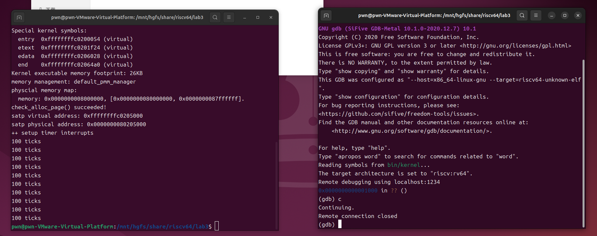
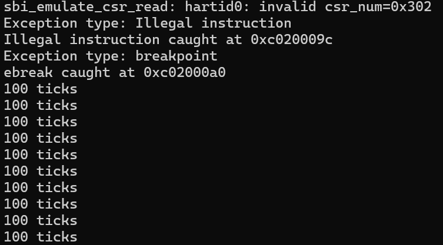

# Lab3

## 练习1：完善中断处理 

### 实现过程

首先引入必要项

```C
#include <sbi.h>            /* 提供 sbi_shutdown() 原型（OpenSBI 封装） */
extern volatile size_t ticks; /* clock.c 中定义的全局 tick 计数器 */
```

完成`case IRQ_S_TIMER`的实现：

先调用 `clock_set_next_event()` 安排下一次定时器（否则时钟中断只会触发一次）。

使用 `ticks++` 累计中断次数。

`print_count` 为静态变量，在函数内保存打印次数。

当 `print_count >= 10` 时调用 `sbi_shutdown()`。

以下为代码：

```C
case IRQ_S_TIMER: {
    /* 调用 clock 驱动中安排下次时间的函数（在 clock.c 中实现） */
    extern void clock_set_next_event(void);
    clock_set_next_event();

    /* 增加计数（clock.c 中的 ticks 已用 volatile 声明） */
    ticks++;

    /* 使用文件内静态变量记录已经打印了多少次 "100 ticks" */
    static int print_count = 0;

    if (ticks % TICK_NUM == 0) {
        print_ticks(); /* 在本文件已实现，打印 "100 ticks" */
        print_count++;

        if (print_count >= 10) {
            /* 调用 OpenSBI 的关机接口 */
            sbi_shutdown();
        }
    }
    break;
}
```

可以看到成功运行，并在十次输出之后退出



### 中断处理流程

```
硬件计时器（mtime）
     │
     │（时间到达）
     ▼
OpenSBI（sbi_set_timer）
     │
     │（触发中断信号）
     ▼
CPU：检测到中断，跳转到 stvec 地址
     │
     ▼
trapentry.S（汇编入口，保存寄存器）
     │
     ▼
trap.c → trap() 函数
     │
     ▼
识别中断类型，调用对应处理逻辑（例如 clock.c）
     │
     ▼
print_ticks() 打印 / sbi_shutdown() 关机

```

`OpenSBI`中提供了`sbi_set_timer`函数，调用时即会向`CPU`发送中断信号，其中的`stvec`用于记录`trap`入口的地址，指向 `trapentry.S` 中的 `__alltraps`（具体在`challenge1`中解释）

```
__alltraps:
    SAVE_ALL

    move  a0, sp
    jal trap
    # sp should be the same as before "jal trap"
```
`trapentry.S`会保存所有寄存器的当前状态，以便于后续进行上下文切换，然后跳转至`trap`，在`trap.c`中按照不同情况进行分发，并执行对应的处理，也就是上面修改完善的部分

## 扩展练习 Challenge1：描述与理解中断流程

### 处理中断异常的流程

#### 异常/中断产生

`CPU` 在执行指令时发现异常或者时钟中断信号到来时，会进行以下操作：

  - 自动保存当前 `PC` 到 `sepc`
  - 将异常原因写入 `scause`
  - 将当前状态保存到 `sstatus`
  - 跳转到 `stvec` 指定的入口地址
  
#### 进入 `__alltraps`
这是中断的汇编入口。
它负责保存所有寄存器状态、建立栈帧，最终调用 `C` 函数 `trap()`。

### mov a0, sp的目的

把当前栈指针 `sp`（指向保存的结构体）传给`trap()`的第一个参数（`a0` 是函数第一个参数寄存器）。

也就是说，`trap`通过参数`a0`获得了保存全部寄存器的结构体的地址。

### SAVE_ALL 寄存器在栈中保存位置的确定

在 `SAVE_ALL` 中按寄存器编号和保存顺序固定偏移存放（如 `x0` 在 `0`，`x1` 在 `1×REGBYTES`，…），共占 `36×REGBYTES` 的连续空间。

<u>*REGBYTES是`riscv.h`定义的常量，表示一个寄存器占据几个字节*</u>

### 是否需要保存所有寄存器

是

## 扩展练习 Challenge2：理解上下文切换机制

### `csrw sscratch, sp` 和 `csrrw s0, sscratch, x0` 的操作和目的

#### `csrw sscratch, sp`
- **操作**：将当前栈指针 `sp` 的值写入 `sscratch` 控制状态寄存器
- **目的**：在异常/中断开始时保存用户空间的栈指针。这样在异常处理期间：
  - `sscratch` 保存了用户栈指针
  - `sp` 可以切换到内核栈用于异常处理

#### `csrrw s0, sscratch, x0`
- **操作**：交换 `sscratch` 和 `x0` 的值，结果保存到 `s0`
  - 从 `sscratch` 读取原值到 `s0`
  - 将 `x0`（硬编码为0）写入 `sscratch`
- **目的**：
  1. 将用户栈指针从 `sscratch` 恢复到 `s0` 寄存器，以便后续保存到陷阱帧中
  2. 将 `sscratch` 清零，作为递归异常的标志：
     - 如果 `sscratch == 0`，表示异常来自内核
     - 如果 `sscratch != 0`，表示异常来自用户空间

### 为什么保存但不恢复 `stval`、`scause` 等CSR

#### 保存的意义：
1. **诊断和调试**：在异常处理过程中，`trap.c` 中的处理函数需要这些信息来确定异常原因、错误地址等
2. **信息传递**：这些CSR包含了异常的关键信息，需要传递给C语言的异常处理程序
3. **现场快照**：保存完整的异常现场，便于后续分析和恢复

#### 不恢复的原因：
1. **只读性质**：`scause`（异常原因）和 `stval`（`sbadaddr`，错误地址）等CSR是**只读**的，由硬件在异常发生时自动设置，软件无法修改
2. **临时状态**：这些寄存器表示的是异常发生时的瞬时状态，不是需要保持的架构状态
3. **无用恢复**：恢复这些寄存器没有意义，因为：
   - 异常原因在异常处理完成后不再相关
   - 错误地址在异常解决后不再有用
   - 这些值在下一个异常发生时会被硬件重新设置

#### 需要恢复的CSR：
- `sstatus`：包含处理器状态标志，影响后续执行
- `sepc`：异常程序计数器，决定异常返回后从哪里继续执行

**总结**：保存是为了给异常处理程序提供信息，不恢复是因为这些是只读的瞬时状态，恢复它们既不可能也无必要。

## 扩展练习 Challenge3：完善异常中断

在`kern/trap/trap.c`中编写代码如下：

```C
case CAUSE_ILLEGAL_INSTRUCTION:
    // 非法指令异常处理
    /* LAB3 CHALLENGE3   2311205  */
    /*(1)输出指令异常类型（ Illegal instruction）
     *(2)输出异常指令地址
     *(3)更新 tf->epc寄存器
    */
    cprintf("Exception type: Illegal instruction\n");
    cprintf("Illegal instruction caught at 0x%08x\n", tf->epc);
    tf->epc += 4;
    break;
case CAUSE_BREAKPOINT:
    //断点异常处理
    /* LAB3 CHALLLENGE3   2310711  */
    /*(1)输出指令异常类型（ breakpoint）
     *(2)输出异常指令地址
     *(3)更新 tf->epc寄存器
    */
    cprintf("Exception type: breakpoint\n");
    cprintf("ebreak caught at 0x%08x\n", tf->epc);
    tf->epc += 2; //这里由于ebreak占2个字节，所以下一条指令偏移为2
    break;
```
**非法指令异常处理**：当`CPU`遇到无法识别的指令时，系统会输出异常类型和触发地址，然后将程序计数器`tf->epc`增加`4`字节跳过这条非法指令，确保程序能够继续执行后续代码。

**断点异常处理**：当程序执行`ebreak`指令时，系统会输出断点类型和指令地址，然后将程序计数器`tf->epc`增加`2`字节跳过这个断点指令，这通常用于调试器设置断点或程序调试目的。

为了测试上述两种异常处理机制，我们在 `kern/init/init.c` 中 `intr_enable()` 之后加入以下代码：

```C
asm("mret");
asm("ebreak");
```
**`asm("mret")`**：`mret` 是机器模式`（M-mode）`特权指令，在监督模式`（S-mode）`下执行会触发非法指令异常。

**`asm("ebreak")`**：`ebreak` 是显式的断点指令，用于触发断点异常。

运行后输出如下：



可以看到测试成功。

## 知识点汇总

### 本实验中的重要知识点及与OS原理的对应

#### 中断/异常处理机制
实验体现：trapentry.S中的SAVE_ALL、RESTORE_ALL，trap.c中的异常分发

OS原理：中断向量表、上下文切换、异常处理流程

关系与差异：实验通过RISC-V的stvec寄存器实现中断向量，原理课通常讲解x86的IDT；实验展示了从硬件异常到软件处理的完整流程，但简化了优先级处理和嵌套中断

#### 时钟中断处理
实验体现：IRQ_S_TIMERcase中的clock_set_next_event()和ticks计数

OS原理：时间片调度、定时器管理、系统时钟

关系与差异：实验实现了基本的时钟中断响应，但原理中的多级时间轮盘、高精度定时器等复杂机制没有体现

#### 上下文保存与恢复
实验体现：SAVE_ALL宏保存所有寄存器，RESTORE_ALL恢复关键状态

OS原理：进程上下文、保护现场、状态恢复

关系与差异：实验展示了寄存器级的状态保存，原理还包含内存映射、文件描述符等更广泛的上下文概念

#### 特权指令与保护机制
实验体现：mret指令触发的非法指令异常

OS原理：CPU特权级、指令保护、安全边界

关系与差异：实验通过具体指令验证保护机制，原理涵盖更全面的保护域和权限管理

#### 调试支持机制
实验体现：ebreak指令的断点异常处理

OS原理：调试器原理、单步执行、观察点

关系与差异：实验实现了基本的断点支持，原理包含符号调试、条件断点等高级特性

### OS原理重要但在实验中缺失的知识点

#### 中断优先级和屏蔽
重要性：处理中断竞争、确保关键操作不被中断

实验缺失：没有体现不同中断源的优先级管理，没有中断屏蔽/使能的精细控制

#### 嵌套中断处理
重要性：处理中断处理过程中被更高优先级中断打断的情况

实验缺失：实验假设中断处理是原子的，没有处理嵌套场景

#### 中断下半部处理机制
重要性：将耗时中断处理延迟执行，减少中断关闭时间

实验缺失：所有中断处理都在中断上下文中同步完成

#### 设备中断处理
重要性：实际系统中大部分中断来自外设

实验缺失：只有时钟中断，没有磁盘、网络等设备中断处理

#### 用户态与内核态中断差异
重要性：用户程序触发异常与内核异常的不同处理

实验缺失：实验主要在内核态运行，没有体现用户态异常的处理差异